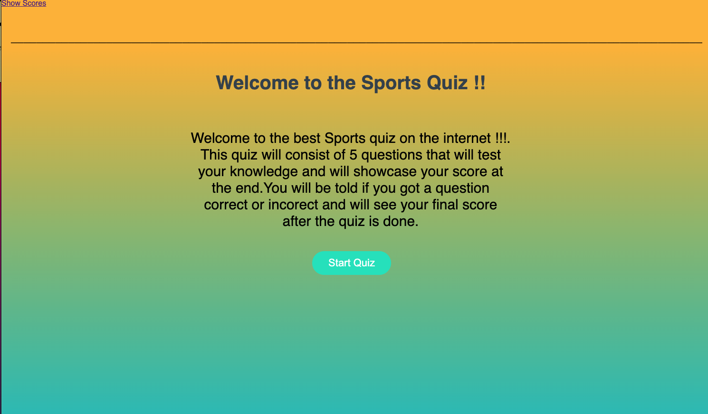

# Interactive-Javascript-Quiz
This application is powered by Javascript to prompt questions and stores the users data after the quiz is complete 

The application will start once the user clicks on the start button and will me asked 5 questions. If the user gets one wrong time from the timer will be subtracted. The user will also be shown a message stating if they got teh question right or wrong.
At the end the user will see their score and will be asked to type in their name and they will submit where they will then see their scores. 
The data will be saved so the user can refresh or restart the quiz and come back and see the scores 

This project focuses on Functions within Javascript

